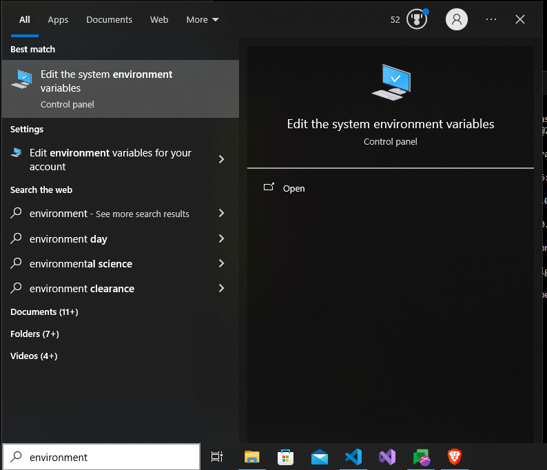

# Socialsprash Mobile App

## Initial Setup

1. **Download Android Studio:**

   - Download Android Studio from [here](https://developer.android.com/studio).
   - Complete the installation with all default options.

2. **Setting up Environment Variables:**

   - **JAVA_HOME:**

     - Navigate to the Android Studio installation directory and open the `jbr` folder. Copy its path (e.g., `C:\Program Files\Android\Android Studio\jbr`).

       

     - Open the Start menu, search for "Edit the system environment variables," and open it. Click on "Environment Variables."

       

     - Click on "New" in the "System variables" section.

     - Set the variable name as `JAVA_HOME` and the variable value as the path to your JDK installation (e.g., `C:\Program Files\Android\Android Studio\jbr`). Click "OK."

       

     - Double click on "Path" in the "System variables" section, click on "New," and add the path to the `bin` folder in `jbr` (e.g., `C:\Program Files\Android\Android Studio\jbr\bin`).

       

- **ADB Path:**

  - Locate the `adb.exe` file in your Android SDK installation (e.g., `C:\Users\YourUsername\AppData\Local\Android\Sdk\platform-tools`).

    

  - Add this path to your system's PATH variable and click "OK."

    

3. **Finalize Environment Setup:**
   - Close all dialog boxes by clicking "OK." Environment variables are now set up successfully.

- **Check ADB Installation:**
  - Open a command prompt (CMD) and run the 'adb' command to check if ADB is installed correctly: `adb`. You should see a list of ADB commands if it's installed properly.
    

## Running the Project

1.  **Clone the Project and Open in VS Code:**

    - Clone the Socialsprash Mobile App project from your repository.
    - Open the project folder in Visual Studio Code.

2.  **Install Dependencies:**

    - Run the following command in the terminal to install project dependencies:
      ```
      npm install
      ```

3.  **Generate Android and iOS Native Code:**

        - Run the following command to generate Android and iOS native code:
          ```
          npx expo prebuild
          ```
        - This command is used to prebuild the native code for Android and iOS platforms. It prepares the necessary native code files that are required for building the app on Android Studio (for Android) and Xcode (for iOS) later in the development process.

    <details>
    <summary>4. **Run and Build the Project:**</summary>

- Go back to Visual Studio Code.
- You are now ready to run and build the project using multiple methods:

  - **Using Expo Go (For Basic Testing):**

    - Install Expo Go on your Android device from the Google Play Store.
    - Run the following command in the terminal to start the Expo server:
      ```
      npm start
      ```
    - Scan the QR code displayed in the terminal or Metro Bundler with Expo Go to open the app.

  - **On a Native Android Device:**
    - Ensure your Android device is connected to your computer via USB and USB debugging is enabled.
    - Run the following command in the terminal to build and run the app on your device:
      ```
      npm run android
      ```

</details>
